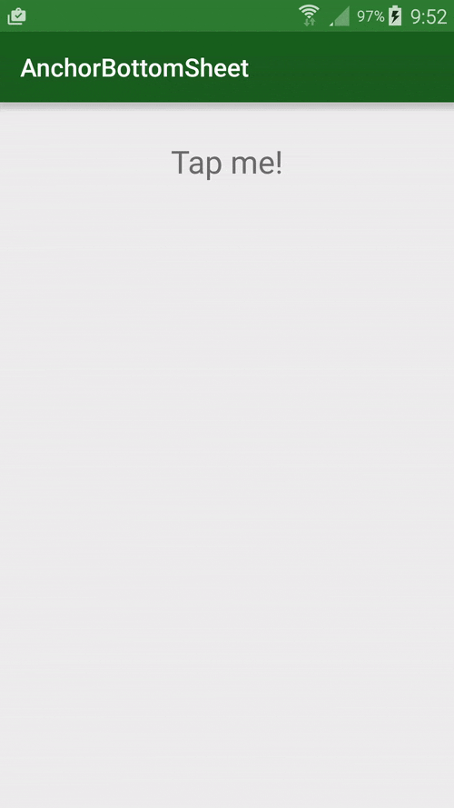

# AnchorSheetBehavior
[](https://jitpack.io/#skimarxall/AnchorSheetBehavior)


Modification of the BottomSheetBehavior with Anchor state.

Fine more about it at [the medium blog post](https://medium.com/@marxallski/from-bottomsheetbehavior-to-anchorsheetbehavior-262ad7997286#.m02n38t27).



# Integration 

```groovy
allprojects {
    repositories {
        ...
        maven { url 'https://jitpack.io' }
    }
}
```
Add AnchorSheetBehavior dependency:
```groovy
dependencies {
    compile 'com.github.skimarxall:AnchorSheetBehavior:master-SNAPSHOT'
}
```

# Usage

The behavior is an extension of the Android support design, thus the usage is the same.
The only addition is two extra states:
* STATE_ANCHOR: push the bottom sheet to an anchor state defined by Anchor offset
* STATE_FORCE_HIDE: force the bottom sheet to hide regardless of hideable flag

``` java
/**
* Set the offset for the anchor state. Number between 0..1
* i.e: Anchor the panel at 1/3 of the screen: setAnchorOffset(0.25)
*
* @param threshold {@link Float} from 0..1
*/
public void setAnchorOffset(float threshold) {
    this.mAnchorThreshold = threshold;
    this.mAnchorOffset = (int) Math.max(mParentHeight * mAnchorThreshold, mMinOffset);
}
```

For more usage see [Android docs](https://developer.android.com/reference/android/support/design/widget/BottomSheetBehavior.html)

License
=======

    Copyright 2015 Marcel Pintó Biescas

    Licensed under the Apache License, Version 2.0 (the "License");
    you may not use this file except in compliance with the License.
    You may obtain a copy of the License at

       http://www.apache.org/licenses/LICENSE-2.0

    Unless required by applicable law or agreed to in writing, software
    distributed under the License is distributed on an "AS IS" BASIS,
    WITHOUT WARRANTIES OR CONDITIONS OF ANY KIND, either express or implied.
    See the License for the specific language governing permissions and
    limitations under the License.

